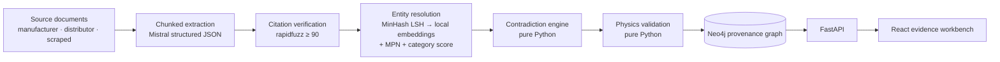
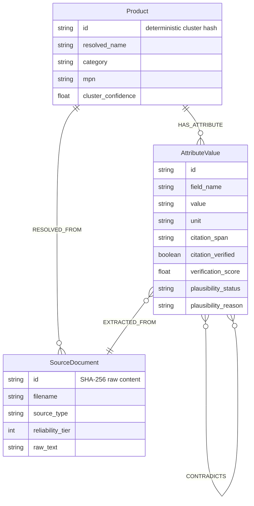

<div align="center">

# SpecGraph

### Intelligence Engine for industrial product evidence

**From fragmented specifications to auditable product truth.**

[](https://www.python.org/)
[](https://fastapi.tiangolo.com/)
[](https://react.dev/)
[](https://neo4j.com/)
[](https://mistral.ai/)

[Live deployment](https://specgraph-intelligence-engine.onrender.com/) · [API health](https://specgraph-intelligence-engine.onrender.com/health) · [Demo script](#two-minute-demo-script) · [Architecture](#architecture)

</div>

---

## The problem

Industrial product data rarely arrives as one clean record. A bearing may have a manufacturer datasheet, a distributor listing, and a scraped catalogue entry—all naming it slightly differently, all carrying different levels of authority, and sometimes disagreeing on a physical specification.

Most AI catalog tools answer this by asking an LLM to choose a value. **SpecGraph does not.** It makes the evidence chain visible and keeps the deterministic decisions inspectable.

> **The central claim:** Mistral extracts claims. It never decides what is true. SpecGraph traces each claim to source text, resolves the underlying product, detects disagreement, and independently checks physical plausibility.

| The usual failure mode | What SpecGraph does instead |
| --- | --- |
| An LLM returns one polished answer | Retains every extracted value and its source |
| A citation is treated as trusted text | Fuzzy-verifies it against the source chunk |
| Conflicting specifications are overwritten | Shows both values and the reliability-based preference |
| Product matching is opaque | Uses MinHash candidates, local embeddings, MPN normalization, and category agreement |
| A spec is accepted because it sounds reasonable | Runs deterministic electrical, dimensional, and unit-family checks |

## What a judge can verify

The demo dataset contains **54 source documents** resolving to **18 products** across bearings, relays/contactors, and fasteners.

| Evidence scenario | What to look for |
| --- | --- |
| Source disagreement | Two engineered products contain numeric values beyond the 2% equivalence tolerance. Both values remain in the graph. |
| Electrical invalidity | One relay deliberately violates `P = V × I` by more than 5%. |
| Identity resilience | One product’s MPN varies in dashes, spaces, and leading zeros across all three sources yet resolves to one Product. |
| Citation integrity | One deliberately wrong citation is visibly marked unverified and reveals the nearest real source text. |
| Provenance | Every claim can be followed from Product → AttributeValue → SourceDocument. |

## Architecture



### Trust boundary

```text
LLM boundary
────────────
✓ pipeline/extraction imports app/llm
✗ entity_resolution imports app/llm
✗ contradiction imports app/llm
✗ validation imports app/llm
```

`backend/app/check_boundaries.py` statically enforces this rule. Entity resolution, contradiction adjudication, and validation are deterministic Python stages that can be inspected and tested without an LLM.

### Pipeline, step by step

1. **Ingest** — source text receives a deterministic SHA-256 `SourceDocument.id`; duplicate content upserts instead of duplicating.
2. **Extract** — the document is split into bounded chunks and Mistral returns a strict JSON claim schema. `MISTRAL_MODEL` is configurable; the LLM is not a fallback source of truth.
3. **Verify citation** — `rapidfuzz.token_sort_ratio` compares each claimed citation to its source chunk. A score of `≥ 90` is verified. Failed verification retains both the claimed span and nearest actual source text.
4. **Resolve identity** — character-trigram MinHash LSH generates candidates before any scoring. Candidate pairs are scored with local CPU ONNX `all-MiniLM-L6-v2` embeddings (55%), normalized MPN fuzziness (30%), and category match (15%). The cluster threshold is `0.78`.
5. **Normalize units** — supported length, power, voltage, current, resistance, density, and melting-point conversions are expressed in explicit Python mappings; mismatched unit families become an explainable invalid state.
6. **Adjudicate disagreement** — numeric values within 2% are equivalent; values outside it create `CONTRADICTS` relationships. Text values use punctuation/case/whitespace normalization. Nothing is averaged or discarded.
7. **Validate physics** — independent rules check `P = VI`, `V = IR`, bore vs. outer diameter, positive dimensions, total-length ordering, unit families, and a reference table of industrial materials.
8. **Explain** — Neo4j persists the product, documents, attributes, source edges, and contradiction edges. The interface renders that evidence directly.

## Product experience

| View | Designed for | What it answers |
| --- | --- | --- |
| **Catalog** | Procurement and operations | Which products need review? How many sources support each record? |
| **Product detail** | Engineering review | What did each source say, what was preferred, and why? |
| **Evidence rail** | Citation audit | Is this claim actually present in the source text? |
| **Graph explorer** | Provenance inspection | Which documents and attributes form this resolved product? |
| **Ingestion panel** | Demo and operations | Which real document is at which persisted pipeline stage? |

The UI intentionally avoids dashboard theatre: no fabricated metrics, decorative charts, or inferred progress. Status language is explicit, numeric data is monospace, and each visible value has a provenance path.

## Data model



Reliability tiers are intentional: `1` manufacturer datasheet, `2` distributor listing, `3` scraped page. Automated preferences choose the lowest tier number while retaining all competing evidence.

## Two-minute demo script

1. Open the [live application](https://specgraph-intelligence-engine.onrender.com/). A free Render service may need a brief cold start.
2. Select **Ingest** → **Reset demo dataset**.
3. Watch the ingestion panel: it polls the real `GET /api/jobs/{id}` response every two seconds and renders real per-document stages—never a timer-derived percentage.
4. Filter the catalog by **Contradictions**, **Implausible**, or **Unverified**.
5. Open a product. Follow an evidence rail from normalized value to source filename, source type, reliability tier, exact citation, and verification score.
6. Expand the unverified citation to see the claimed text beside the nearest actual source text.
7. Open **View provenance graph** to inspect the Product → AttributeValue → SourceDocument chain.

## API

| Method | Endpoint | Purpose |
| --- | --- | --- |
| `GET` | `/health` | Reports live Neo4j connectivity and whether Mistral is configured |
| `POST` | `/api/ingest` | Queues a batch of source documents |
| `GET` | `/api/jobs/{id}` | Returns overall status, retries, errors, and per-document stages |
| `GET` | `/api/products?q=` | Searches resolved name, normalized MPN, category, controlled field names, and values |
| `GET` | `/api/products/{id}` | Returns product evidence, documents, and disagreements |
| `GET` | `/api/products/{id}/graph` | Returns graph nodes and links for the explorer |
| `POST` | `/api/demo/reset` | Clears the graph and queues the real seed corpus |

Job lifecycle: `pending → processing → retrying → completed | failed`.

Document lifecycle: `queued → extracting → verifying_citations → resolving_entities → adjudicating_contradictions → validating → completed | failed`.

Transient/rate-limit failures retry at 1s, 2s, and 4s. A document that exhausts retries has an explicit error; successful documents in the same batch remain available.

## Repository map

```text
specgraph/
├── backend/
│   ├── app/
│   │   ├── api/                 # FastAPI routes
│   │   ├── domain/              # models + controlled unit conversions
│   │   ├── graph/               # Neo4j constraints, persistence, queries
│   │   ├── jobs/                # in-process job interface
│   │   ├── llm/                 # Mistral provider + test-only fixture
│   │   └── pipeline/            # deterministic processing stages
│   └── tests/
├── frontend/
│   └── src/
│       ├── views/               # catalog, detail, graph explorer
│       ├── components/          # evidence rail, status, ingestion panel
│       ├── api/ + hooks/
│       └── styles/
├── seed/                        # 54 plain-text source documents
├── docker-compose.yml           # Neo4j 5.x for local development
├── Dockerfile                   # production API + built frontend
└── render.yaml                  # Render Blueprint
```

## Run locally

### Prerequisites

- Docker Desktop
- Python 3.12 and [uv](https://docs.astral.sh/uv/)
- Node.js 22+
- A Mistral API key

### 1. Start Neo4j

```bash
docker compose up -d
```

Neo4j Browser is available at `http://localhost:7474`; Bolt is on `localhost:7687`.

### 2. Configure the backend shell

The backend reads environment variables directly. Copy `.env.example` as a reference, but export the values into the shell that starts FastAPI.

**PowerShell**

```powershell
$env:NEO4J_URI = "bolt://localhost:7687"
$env:NEO4J_USERNAME = "neo4j"
$env:NEO4J_PASSWORD = "change-me"
$env:NEO4J_DATABASE = "neo4j"
$env:MISTRAL_API_KEY = "replace-with-your-key"
$env:MISTRAL_MODEL = "mistral-small-latest"

cd backend
uv sync --group dev
uv run uvicorn app.main:app --reload
```

**macOS / Linux**

```bash
export NEO4J_URI='bolt://localhost:7687'
export NEO4J_USERNAME='neo4j'
export NEO4J_PASSWORD='change-me'
export NEO4J_DATABASE='neo4j'
export MISTRAL_API_KEY='replace-with-your-key'
export MISTRAL_MODEL='mistral-small-latest'

cd backend
uv sync --group dev
uv run uvicorn app.main:app --reload
```

### 3. Start the frontend

```bash
cd frontend
npm install
npm run dev
```

Open the Vite URL shown in the terminal. It proxies API calls to FastAPI on port 8000.

> **Deliberate failure behavior:** ordinary seed documents are never silently replaced by fixture output when Mistral is missing. The demo reset exposes a per-document ingestion error instead. The fixture provider is reserved for automated tests and the one engineered wrong-citation document.

## Test and quality gates

```bash
# Backend
cd backend
uv sync --group dev
uv run pytest
python -m app.check_boundaries

# Frontend
cd frontend
npm install
npm run build
npm test
```

| Check | Why it matters |
| --- | --- |
| Seed corpus shape | Confirms 54 documents, three source types, and deterministic source IDs |
| Wrong-citation fixture | Confirms the specifically engineered citation is unverified |
| Unit, contradiction, and physics tests | Ensures deterministic behavior stays independent of the LLM |
| 1,000-record LSH benchmark | Demonstrates candidate comparisons are below full `N × N` matching |
| Static import boundary | Prevents deterministic stages from importing `app.llm` |
| Vite build + Vitest | Confirms the frontend compiles and its test suite runs |

## Deploy on Render + AuraDB Free

The deployment is a single Docker web service: FastAPI serves the compiled React application and the API; AuraDB holds the persistent provenance graph.

1. Create an **AuraDB Free** instance in [Neo4j Aura](https://console.neo4j.io/). Save its URI, username, password, and database name.
2. In Render, select **New → Blueprint** and choose this repository on `main`.
3. Render detects `render.yaml`. Add these values as secret environment variables:

   ```text
   NEO4J_URI=neo4j+s://…
   NEO4J_USERNAME=…
   NEO4J_PASSWORD=…
   NEO4J_DATABASE=…
   MISTRAL_API_KEY=…
   MISTRAL_MODEL=mistral-small-latest
   ```

4. Deploy, then open `/health`. It must report `neo4j: "connected"` and `mistral_configured: true`.
5. Trigger **Reset demo dataset** from the application to populate AuraDB through the same pipeline used for ingestion.

`render.yaml` enables deployment from commits on `main`. Render Free can sleep after inactivity, so allow a cold-start request before a presentation.

## Security and operating notes

- Never commit `.env`, Aura credentials, or `MISTRAL_API_KEY`.
- The health endpoint intentionally reflects real connectivity. A disconnected graph returns a degraded health state; it is never presented as an empty catalog.
- A demo reset clears the connected graph database before re-ingesting the seed corpus. Use it only against a demo database.
- AuraDB is the deployed graph store; local Neo4j is only for development. A hosted Render service cannot reach `localhost` on a laptop.

## Built for the engineering conversation

SpecGraph is designed to make a judge ask better questions:

> *Which source said that? Is the citation real? Why did this value win? Does it obey physics? Can I follow it through the graph?*

Every major product decision has a visible, testable answer.

---

<div align="center">

Built for a hackathon demo where **trust is the feature**.

</div>
